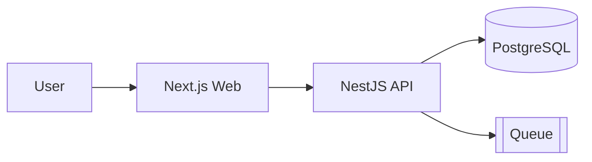

# Architecture Design

ออกแบบ architecture อย่างเป็นระบบ ผลลัพธ์คือ **design doc ที่ dev อ่านแล้ว implement ตามได้ทันที**
โดยไม่ต้องเดา shape ที่หายไป — พร้อม ADR ที่บอก "เลือกอะไร เพราะอะไร แลกกับอะไร"

## เป้าหมาย

design ที่ดีคือ design ที่ **ลด ambiguity ให้ dev** ไม่ใช่เอกสารสวยที่ไม่มีใครอ่าน
- แต่ละ decision ต้องตอบได้ว่า **ทำไมถึงเลือกทางนี้ ไม่เลือกทางอื่น** (ADR)
- แต่ละ module/service ต้องตอบได้ว่า **มันทำอะไร / ใช้ยังไง / depend อะไร** (boundary ชัด)
- integration ทุกจุดต้องมี **contract** ที่ทุกฝั่งยึดร่วมกัน ไม่ใช่ต่างคนต่างเดา
- ออกแบบให้ **fit ของเดิม** ในโปรเจกต์ ไม่ใช่ยัด pattern ใหม่ที่ขัด convention

## ขั้นตอน

1. **อ่าน context ก่อนเสมอ** — `docs/plan/<feature>.md` (Lead เขียน requirement), CLAUDE.md ของ repo (convention/architecture เดิม), โครงโค้ด + schema เดิมที่เกี่ยวข้อง อย่าออกแบบในสุญญากาศ
2. **สรุป constraint + non-functional requirement** — scale คาดหวัง, latency, security boundary, data sensitivity, ทีม/skill ที่มี, deadline — สิ่งเหล่านี้ขับการตัดสินใจ
3. **เสนอ approach ≥ 2 แบบ** พร้อม tradeoff (ดู tradeoff matrix ด้านล่าง) — อย่าเสนอทางเดียวแล้วบอกว่า "ทางที่ถูก"
4. **ตัดสินใจ (ADR)** — เลือก 1 approach ระบุเหตุผล + สิ่งที่ยอมแลก + ทางที่ปฏิเสธและทำไม
5. **นิยาม boundary** — module/service/layer, ใครเป็นเจ้าของ data ไหน, dependency direction (ห้าม cycle)
6. **นิยาม integration points** — endpoint/event/queue ที่ข้าม boundary + ชี้ว่าต้องมี `docs/contracts/<api>.md` ตัวไหนบ้าง (ส่งต่อ backend นิยาม)
7. **map งานเป็น task ต่อ dev role** — ส่วนไหน frontend/backend/mobile/devops ทำ + acceptance ระดับ design
8. **ระบุ risks + mitigation** — failure mode, rollout/migration, observability ที่ต้องมี
9. เขียนทุกอย่างลง `docs/architecture/<feature>.md` — ถ้าใน project มี `templates/architecture-template.md` (Lead copy มาจาก repo agent-teams) ให้ใช้ ถ้าไม่มีใช้โครงใน "รูปแบบผลลัพธ์" ด้านล่าง

## Tradeoff matrix (ใช้ประเมินทุก approach)

ให้คะแนน/บรรยายแต่ละ approach ตามแกนเหล่านี้ — แกนไหนไม่เกี่ยวกับงานนี้ตัดออกได้:

| แกน | ถามว่า |
|-----|--------|
| Complexity | สร้าง + เข้าใจ + debug ยากแค่ไหน |
| Scalability | โตได้แค่ไหนก่อนต้องรื้อ |
| Performance | latency / throughput ที่คาดหวังทำได้ไหม |
| Security | attack surface, data exposure, trust boundary |
| Maintainability | คนใหม่เข้าใจ + แก้ต่อได้ง่ายไหม, lock-in แค่ไหน |
| Cost / time | แรง + เวลา + ค่า infra |
| Fit | เข้ากับโค้ด/convention/skill ที่ทีมมีอยู่ไหม |

หลีกเลี่ยง over-engineering — **YAGNI**: ออกแบบเผื่อ scale ที่ "จะมาจริง" ไม่ใช่ scale ในจินตนาการ
ถ้า requirement ยังเล็ก ให้เลือก approach ที่เรียบที่สุดที่ตอบโจทย์ และระบุ "เมื่อไหร่ควร revisit"

## ADR format (ต่อ 1 decision)

```
### ADR-<n>: <หัวข้อการตัดสินใจ>
- **Context:** <สถานการณ์/constraint ที่บังคับให้ต้องตัดสินใจ>
- **Decision:** <เลือกอะไร>
- **Rationale:** <ทำไมทางนี้ชนะ — อ้าง tradeoff matrix>
- **Rejected:** <ทางอื่นที่พิจารณา + ทำไมไม่เลือก>
- **Consequences:** <ผลที่ตามมา ทั้งดีและสิ่งที่ยอมแลก, สิ่งที่ต้องระวังตอน implement>
```

## Diagram (C4-lite ด้วย mermaid)

ใส่ diagram เมื่อช่วยให้เข้าใจเร็วขึ้น — ไม่ต้องครบทุกระดับ เลือกที่ relevant:
- **Context** — ระบบเราคุยกับใคร/อะไรบ้าง (user, external service)
- **Container** — แยกเป็น web / api / db / queue / worker อะไรบ้าง คุยกันยังไง
- **Component** — ภายใน container หนึ่ง module/service อะไรบ้าง dependency ไปทางไหน
- **Data** — entity + relation (ใช้ mermaid `erDiagram`)



## Checklist เฉพาะ stack

### NestJS (backend)
- แบ่ง module ตาม domain ไม่ใช่ตาม technical layer; dependency direction ชัด ไม่มี circular
- Data ownership: ใคร write entity ไหน — เลี่ยงหลาย service เขียนตารางเดียวกันตรง ๆ
- Transaction boundary: operation ข้าม aggregate ต้องคิด consistency (transaction เดียว vs eventual)
- Auth/authorization เป็น cross-cutting (guard/interceptor) ไม่กระจายใน business logic
- Migration strategy: schema change แบบ backward-compatible (expand → migrate → contract)

### Next.js (frontend)
- แยก server vs client boundary ชัด (RSC / client component); secret อยู่ฝั่ง server เท่านั้น
- Data fetching strategy: SSR / ISR / client fetch — เลือกตาม freshness + SEO need
- State ownership: server state (react-query ฯลฯ) แยกจาก UI state; source of truth เดียว

### Flutter / React Native (mobile)
- Layered: presentation / domain / data แยกชัด, dependency ชี้เข้าหา domain
- Offline / sync strategy ถ้าต้อง; local store (cache) เป็นเจ้าของ state ตอน offline
- React Native: ยึด **bare/pure RN เท่านั้น ห้าม `expo-*`** (ตาม es-coding-convention)

### LINE LIFF
- Token verification ฝั่ง backend เสมอ — ไม่ trust profile จาก client
- แยก LIFF ID / channel ต่อ environment; กำหนด endpoint ที่ต้อง verify ID token

### PostgreSQL (data)
- Normalize ก่อน แล้ว denormalize เมื่อมีเหตุ performance จริง (วัดก่อน)
- Index ตาม query pattern ที่ออกแบบไว้; ระบุ unique/foreign key constraint ใน design
- Soft delete / audit / multi-tenancy isolation ถ้า project ต้องการ — กำหนดตั้งแต่ design

## รูปแบบผลลัพธ์

เขียนลง `docs/architecture/<feature>.md` — โครงหลัก (ตรงกับ `templates/architecture-template.md` ของ repo agent-teams):

```
## Architecture: <feature>

### Context & Constraints
<requirement สรุป + non-functional + สิ่งที่ fix ไว้แล้ว>

### Options considered
| Approach | Complexity | Scalability | ... | สรุป |

### Decisions (ADR)
ADR-1 ... ADR-2 ...

### Boundaries
<module/service/data ownership + dependency direction (+ diagram)>

### Integration points
<endpoint/event ข้าม boundary + contract ที่ต้องนิยาม (docs/contracts/...)>

### Tasks → dev roles
| ส่วน | role | acceptance ระดับ design |

### Risks & non-functional
<failure mode, migration/rollout, observability, security boundary>
```

หลักการ: ทุก decision มี **why**, ทุก boundary มี **owner**, ทุก integration มี **contract**
ถ้าตัดสินใจไม่ได้เพราะข้อมูลขาด → ระบุเป็น **open question** ส่งกลับ Lead อย่าเดาแล้วล็อก design
