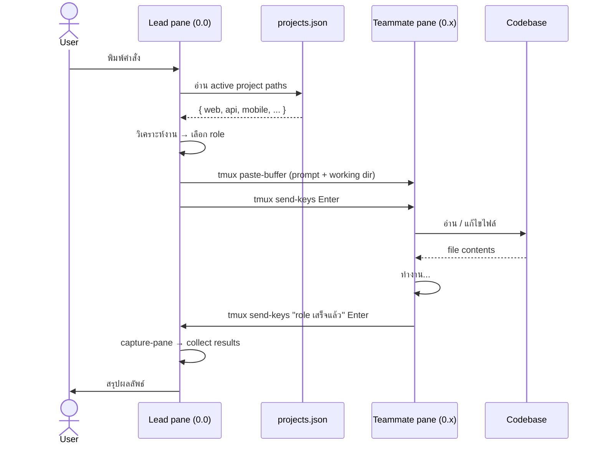
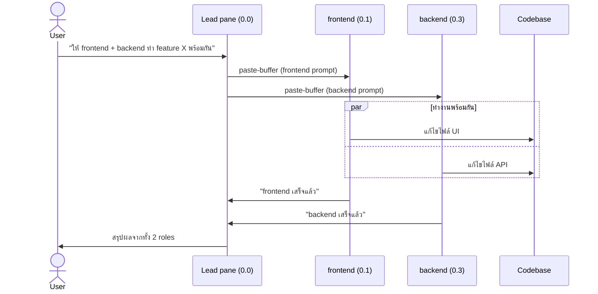

# Dev Team Orchestrator

Multi-agent dev team ที่ใช้ Claude Code + tmux — **Lead** หนึ่งตัวคุม **specialist teammates 8 ตัว** ทำงานข้ามโปรเจ็คได้

แทนที่จะสั่งงาน AI ทีละขั้นตอนด้วยตัวเอง คุณแค่บอก Lead ว่าต้องการอะไร — Lead จะวิเคราะห์งาน เลือก role ที่เหมาะสม spawn agent ไปทำงานพร้อมกันหลายตัว แล้วสรุปผลลัพธ์กลับมาให้ เหมือนมีทีม dev คอยรับงานตลอดเวลา

แต่ละ role เป็น Claude Code agent ที่รันใน tmux pane ของตัวเอง มี working directory และ scope ชัดเจน — architect ออกแบบ system/ADR, frontend แก้ UI, backend แก้ API, qa เขียน test, reviewer ตรวจ code ฯลฯ ทำงานแบบ parallel ได้โดยไม่ต้องรอกัน

รองรับหลาย project ในเครื่องเดียวกัน — สลับ context ได้ทันทีโดยระบุชื่อ project ตอน start

## Modes: v1 (default) / v2

ระบบมี 2 โหมดการทำงาน:

| | **v1** — `start-team.sh` (default) | **v2** — `start-team-v2.sh` |
|---|---|---|
| Agent | Claude 8 process รันค้างใน pane | spawn on-demand ผ่าน **Agent tool** |
| Pane | interactive Claude (พิมพ์คุยได้) | **log viewer** (`tail -f /tmp/agent-logs/<role>.log`) |
| ส่งงาน | `tmux paste-buffer` + ack | Agent tool (structured prompt) |
| รับผล | scrape pane + "เสร็จแล้ว" | **return value** ตรงๆ |
| เด่นเรื่อง | เห็น + คุยกับ agent ได้ตรง | handoff เชื่อถือได้ context ไม่หาย |

v2 = hybrid: ได้ความน่าเชื่อถือแบบ structured spawn **พร้อม** visibility แบบ V1 (เห็น agent แต่ละตัวทำงานแยก pane) — agent เขียน progress ลง log, pane stream แบบ real-time

> discipline เดียวกันทั้งสองโหมด (plan-as-file, verification gate, contract-first, QA→Reviewer, PASS/FAIL)

## Architecture

```
┌────────┬─────────┬───────────┐
│        │frontend │ designer  │
│        ├─────────┼───────────┤
│        │ backend │ architect │
│  Lead  ├─────────┼───────────┤
│        │ mobile  │    qa     │
│        ├─────────┼───────────┤
│        │ devops  │ reviewer  │
└────────┴─────────┴───────────┘
```

- User สั่งงานผ่าน **Lead** (pane ซ้าย)
- Lead วิเคราะห์งาน → ส่งต่อให้ specialist ผ่าน `tmux paste-buffer`
- Specialist ทำงานได้เลยทันที — รู้ role ของตัวเองก่อน session เริ่ม
- Specialist คุยกันตรงได้ผ่าน tmux โดย CC Lead ทุกครั้ง
- Specialist ทำเสร็จ → รายงานกลับ Lead → Lead สรุปให้ user

## How it works

### Orchestration Flow


---

### Sequence Diagram — Single Agent



---

### Sequence Diagram — Parallel Agents



## Team roster

| Role | Model | Scope |
|---|---|---|
| **Frontend** | Sonnet | React, Next.js, TypeScript, browser extension + unit tests |
| **Backend** | Sonnet | REST/GraphQL, database, business logic + unit tests |
| **Mobile** | Sonnet | React Native, Capacitor.js, iOS/Android native modules + unit tests |
| **DevOps** | Sonnet | CI/CD, Docker, deployment, env config |
| **Designer** | Haiku | Design spec, design tokens, UX review, a11y (ไม่เขียน feature code) |
| **Architect** | Sonnet | System architecture, ADR, tech decisions, module/data boundaries (ไม่เขียน feature code — upstream ของ dev) |
| **QA** | Sonnet | Integration tests, e2e tests, edge cases, regression |
| **Reviewer** | Sonnet | Code quality, security (OWASP + Snyk), code-level performance |

> Model ถูก pin ใน `start-team.sh` (ไม่ขึ้นกับ default ของเครื่อง) — UI work ทุก role เรียก skill `frontend-design` เพื่อเลี่ยงดีไซน์ generic

Agent definitions อยู่ใน [.claude/agents/](.claude/agents/)

## Skills (team playbooks)

นอกจาก agent definition แต่ละ role ยังโหลด **skill** เป็น checklist/convention ร่วม **ก่อนเริ่มงาน** — ทำให้ output deterministic (ไม่ขึ้นกับว่าโมเดลจะนึกถึงเองรอบนั้นไหม) อยู่ใน [.claude/skills/](.claude/skills/) ใช้ prefix `es-` กันชนกับ skill/command built-in

| Skill | โหลดโดย | ใช้ตอน |
|---|---|---|
| **es-architecture** | architect | ก่อนออกแบบ — approach options + ADR + tradeoff matrix + module/data boundary + integration points, output เป็น `docs/architecture/<feature>.md` |
| **es-coding-convention** | frontend, backend, mobile | ก่อนเขียนโค้ด/scaffold ใหม่ — naming, folder structure, error handling, git convention (มี reference แยกต่อ stack: nestjs / nextjs / flutter / react-native / line-liff / postgresql) |
| **es-devops** | devops | ก่อนทำ infra — Dockerfile/compose convention, CI/CD pipeline, env/secret management, deployment + rollback + health (reference แยก: docker / ci-cd / env-secrets / deployment) + security checklist |
| **es-code-review** | reviewer | ก่อน review — severity levels, มิติ 5 ด้าน, checklist เฉพาะ stack, OWASP Top 10 (`references/security.md`), รูปแบบ verdict |
| **es-test-strategy** | qa | ก่อนวาง/ประเมิน test — test pyramid, gap ที่ "ต้องมี", severity, verdict ว่า feature ปล่อยได้ไหม |
| **es-design-system** | designer | ก่อนทำ token/spec — token taxonomy (semantic/primitive), theming (light/dark), **UI states ครบ (loading/empty/error)** + empty state icon+ข้อความทิศทางเดียวกัน, a11y/contrast (references: tokens / states / theming / a11y) |

- ทุก skill เป็น **progressive disclosure**: SKILL.md สั้น โหลด reference เฉพาะ stack/หัวข้อที่ตรงกับงาน (ประหยัด context)
- React Native ยึด **bare / pure RN เท่านั้น — ห้าม `expo-*`** (โปรเจกต์รัน RN เวอร์ชันใหม่ที่ Expo ตามไม่ทัน)
- แก้ได้โดยตรงใน `.claude/skills/<name>/` — มีผลทันทีรอบ spawn ถัดไป

## Prerequisites

**macOS / Linux**

| Requirement | Install |
|---|---|
| [tmux](https://github.com/tmux/tmux) 3.1+ | `brew install tmux` |
| [jq](https://jqlang.github.io/jq/) | `brew install jq` |
| [Claude Code CLI](https://docs.claude.com/en/docs/claude-code) | `npm install -g @anthropic-ai/claude-code` แล้ว `claude login` |

**Windows** `[Beta]`

agent-teams ต้องการ tmux ซึ่งไม่มีใน Windows native — ต้องรันผ่าน **WSL2 (Ubuntu)** เท่านั้น  
ดูขั้นตอนละเอียดที่ [Windows Setup (Beta)](#windows-setup-beta) ด้านล่าง

หรือรัน `./install.sh` เพื่อตรวจและติดตั้ง dependencies อัตโนมัติ (รันใน WSL2)

## Quick start

**macOS / Linux**

```bash
git clone https://github.com/itseed/agent-teams.git
cd agent-teams
./install.sh
```

`install.sh` จะ:
- ตรวจและติดตั้ง dependencies (tmux, jq, Claude CLI)
- สร้าง projects.json จาก example
- ตั้งค่า Snyk (optional)

**Windows** — ดู [Windows Setup (Beta)](#windows-setup-beta)

---

## Windows Setup `[Beta]`

> **หมายเหตุ:** Windows support ยังอยู่ในช่วง Beta — ทีมทดสอบบน WSL2 + Ubuntu เป็นหลัก อาจพบปัญหาเฉพาะ Windows ที่ยังไม่ได้รับการแก้ไข

agent-teams ใช้ tmux สำหรับจัดการ pane หลายตัวพร้อมกัน ซึ่งไม่มีใน Windows native  
วิธีแก้: รันทั้งหมดใน **WSL2** (Windows Subsystem for Linux) — Linux environment ที่รันบน Windows โดยตรง

### สิ่งที่ต้องมี

- Windows 10 version 2004 (build 19041) ขึ้นไป หรือ Windows 11
- PowerShell (มาพร้อม Windows)
- สิทธิ์ Administrator

### ติดตั้ง WSL2

WSL2 คือ Linux environment ที่รันอยู่บน Windows — agent-teams และ tmux ทำงานอยู่ในนี้ทั้งหมด

**วิธีที่ 1 — ใช้ `wsl --install` (แนะนำ, Windows 11 / Win10 2004+)**

เปิด PowerShell as Administrator แล้วรัน:

```powershell
wsl --install
```

คำสั่งนี้จะ:
1. Enable WSL2 และ Virtual Machine Platform อัตโนมัติ
2. ดาวน์โหลดและติดตั้ง Ubuntu (distro เริ่มต้น)
3. แจ้งให้ reboot

หลัง reboot Ubuntu จะเปิดขึ้นมาเองและถามตั้งค่า username / password — ตั้งได้เลย (ไม่ต้องตรงกับ Windows account)

**วิธีที่ 2 — Enable ทีละ feature (กรณี `wsl --install` ไม่ work)**

```powershell
# เปิด PowerShell as Administrator
dism.exe /online /enable-feature /featurename:Microsoft-Windows-Subsystem-Linux /all /norestart
dism.exe /online /enable-feature /featurename:VirtualMachinePlatform /all /norestart
```

Reboot เครื่อง จากนั้นตั้ง WSL default version เป็น 2:

```powershell
wsl --set-default-version 2
```

ติดตั้ง Ubuntu จาก Microsoft Store (ค้นหา "Ubuntu") หรือรัน:

```powershell
wsl --install -d Ubuntu
```

> อ่านรายละเอียดเพิ่มเติมได้ที่ [Microsoft WSL2 Install Guide](https://learn.microsoft.com/en-us/windows/wsl/install)

**ตรวจสอบว่า WSL2 พร้อมใช้งาน**

```powershell
wsl --list --verbose
```

ควรเห็น Ubuntu ที่มี VERSION = 2:

```
  NAME      STATE           VERSION
* Ubuntu    Running         2
```

### ขั้นตอน

**ขั้นที่ 1 — รัน setup-windows.ps1 (ครั้งแรกครั้งเดียว)**

เปิด PowerShell as Administrator แล้วรัน:

```powershell
Set-ExecutionPolicy -Scope Process -ExecutionPolicy Bypass
.\setup-windows.ps1
```

script จะทำให้อัตโนมัติ:
1. Enable WSL2 + Virtual Machine Platform (reboot ถ้าจำเป็น — รัน script อีกครั้งหลัง reboot)
2. ติดตั้ง Ubuntu จาก Microsoft Store (ถ้ายังไม่มี)
3. Clone repo เข้า `~/agent-teams` ใน Ubuntu
4. รัน `install.sh` เพื่อติดตั้ง tmux, jq, Claude CLI

> ถ้า script reboot เครื่อง ให้เปิด PowerShell as Administrator แล้วรัน `.\setup-windows.ps1` อีกครั้ง — script จะต่อจากจุดที่ค้างไว้

**ขั้นที่ 2 — ตั้งค่า Ubuntu user (ครั้งแรกครั้งเดียว)**

เมื่อ Ubuntu เปิดครั้งแรก จะถามชื่อ user และ password สำหรับ Linux — ตั้งได้เลย (ไม่ต้องตรงกับ Windows account)

**ขั้นที่ 3 — แก้ paths ใน projects.json**

เปิด Ubuntu terminal แล้วแก้ไฟล์:

```bash
cd ~/agent-teams
nano projects.json
```

ใส่ absolute path ของ project ที่ต้องการ (Linux path format ใน WSL2):

```json
{
  "active": "myproject",
  "projects": {
    "myproject": {
      "description": "My project",
      "paths": {
        "web": "/home/<username>/projects/myproject/web",
        "api": "/home/<username>/projects/myproject/api"
      }
    }
  }
}
```

> **เข้าถึงไฟล์ Windows จาก WSL2:** ไดรฟ์ Windows อยู่ที่ `/mnt/c/`, `/mnt/d/` ฯลฯ  
> เช่น `C:\Users\you\projects\myapp` → `/mnt/c/Users/you/projects/myapp`

**ขั้นที่ 4 — Start session**

```bash
cd ~/agent-teams
./start-team.sh
```

### การใช้งานประจำวัน (หลัง setup แล้ว)

```bash
# เปิด Ubuntu terminal จาก Start Menu หรือ Windows Terminal
cd ~/agent-teams
./start-team.sh        # เริ่ม session
./stop-team.sh         # หยุด session
```

### ข้อจำกัด Beta

- ทดสอบบน WSL2 + Ubuntu 22.04 เท่านั้น — distro อื่นอาจมีปัญหา
- Claude Code บน WSL2 ยังไม่ผ่านการทดสอบครบถ้วน
- Windows native (CMD / PowerShell) ไม่รองรับ — `start-team.sh` จะแสดง error และหยุดทันที

### หลัง install.sh รัน — แก้ paths ใน projects.json ให้ตรงกับเครื่องของคุณ

`projects.json` ไม่ได้อยู่ใน repo เพราะมี absolute paths ของแต่ละเครื่อง — `install.sh` สร้างไฟล์นี้ให้แล้ว แต่ต้องแก้ paths ให้ตรงกับเครื่องของคุณ:

แก้ `projects.json`:

```json
{
  "active": "myproject",
  "projects": {
    "myproject": {
      "description": "My awesome project",
      "paths": {
        "web": "/absolute/path/to/web",
        "api": "/absolute/path/to/api",
        "mobile": "/absolute/path/to/mobile"
      }
    }
  }
}
```

- `active` = project ที่ใช้เมื่อเรียก `./start-team.sh` โดยไม่ระบุชื่อ
- `paths` = working directory ของ role ที่เกี่ยวข้อง (key ไม่จำเป็นต้องครบ — script มี fallback)

### เริ่ม session

```bash
# เริ่ม session (ใช้ active project จาก projects.json)
./start-team.sh

# เริ่ม session สำหรับ project ที่ระบุ
./start-team.sh pms

# จบ session (ถาม confirm)
./stop-team.sh

# จบทันทีไม่ถาม
./stop-team.sh -f
```

หลัง `start-team.sh` รัน Lead pane จะได้รับ context อัตโนมัติว่า agents พร้อมแล้ว pane ไหน project อะไร — สั่งงานได้เลยโดยไม่ต้องอธิบาย session state ทุกครั้ง

> **ปิด terminal ไปโดยไม่ได้ตั้งใจ?** รัน `./start-team.sh` อีกครั้ง — script จะถามให้ resume session เดิม agent ที่ทำงานค้างอยู่จะยังอยู่ครบ

## วิธีใช้งาน

### สั่งงานผ่าน Lead

พิมพ์คำสั่งเป็นภาษาธรรมชาติใน Lead pane (ซ้าย):

```
เพิ่ม feature login พร้อม API
```

```
ให้ frontend และ backend ทำ feature X พร้อมกัน
```

```
รีวิว code ใน auth module ให้หน่อย
```

Lead จะวิเคราะห์งาน → เลือก role ที่เหมาะสม → spawn teammate → collect results → สรุปกลับ

### รูปแบบคำสั่ง

| แบบ | ตัวอย่าง | พฤติกรรม |
|---|---|---|
| **Natural language** | "เพิ่ม feature login" | Lead ตัดสินใจเองว่าต้องใช้ role ไหน |
| **ระบุ role ตรงๆ** | "ให้ frontend ทำ X" | Lead spawn ตาม role ที่ระบุเลย |
| **หลาย role พร้อมกัน** | "ให้ frontend + backend ทำ X พร้อมกัน" | Lead spawn parallel |

### ติดตามผล

Teammate รายงานกลับผ่าน Lead pane อัตโนมัติ Lead จะสรุปผลลัพธ์ให้หลังทุก role เสร็จ

ดูสถานะ pane ใด ๆ ได้ตรงๆ:

```bash
tmux capture-pane -t dev-team:0.1 -p | tail -20
```

### Agent-to-agent communication

Agent สามารถส่งข้อความหากันโดยตรงได้โดยไม่ต้องผ่าน Lead — แต่จะ CC Lead ทุกครั้งเพื่อให้ Lead รับรู้สถานะ:

```
[frontend → backend] ต้องการ response format ของ /auth/login ก่อนทำ form
[backend → frontend] /auth/login พร้อมแล้ว — POST {email, password}, response {token, user}
```

Lead เห็นทุก message และไม่ต้อง relay ด้วยตัวเอง

## File structure

```
agent-teams/
├── CLAUDE.md                  # คู่มือการทำงานของ Lead (โหลดอัตโนมัติทุก session)
├── README.md                  # ไฟล์นี้
├── projects.json.example      # template — copy เป็น projects.json แล้วแก้ paths
├── projects.json              # (gitignored) paths เฉพาะเครื่องของคุณ
├── install.sh                 # one-command setup (ตรวจ deps, สร้าง projects.json, ตั้งค่า Snyk)
├── start-team.sh              # v1: spawn 8 panes เป็น Claude processes (tmux IPC)
├── start-team-v2.sh           # v2: Lead + log-viewer panes (spawn ผ่าน Agent tool)
├── stop-team.sh               # kill session
├── setup-windows.ps1          # [Beta] Windows setup: WSL2 + Ubuntu + install อัตโนมัติ
├── scripts/
│   └── team-send.sh           # reliable task delivery (paste + submit + verify-landed)
├── templates/                 # copy ไปวางใน docs/ ของ project
│   ├── plan-template.md       # requirements + acceptance criteria
│   ├── architecture-template.md # system design + ADR + tradeoff + boundary
│   └── contract-template.md   # API contract (shape, env vars, errors)
└── .claude/
    ├── agents/                # agent definitions (8 roles)
    │   ├── frontend.md
    │   ├── backend.md
    │   ├── mobile.md
    │   ├── devops.md
    │   ├── designer.md
    │   ├── architect.md
    │   ├── qa.md
    │   └── reviewer.md
    ├── skills/                # team playbooks (โหลดเป็น checklist/convention ก่อนทำงาน)
    │   ├── es-architecture/       # ADR + tradeoff + boundary (output docs/architecture/)
    │   ├── es-coding-convention/  # naming/structure/scaffold ต่อ stack (มี references/)
    │   ├── es-design-system/      # token + theming + UI states (empty/loading/error) + a11y
    │   ├── es-devops/             # docker/ci-cd/env-secrets/deployment + security checklist
    │   ├── es-code-review/        # severity + OWASP Top 10 + verdict (references/security.md)
    │   └── es-test-strategy/      # test pyramid + gap severity + verdict
    └── settings.json          # permissions + hooks
```

## Pane addressing — ใช้ stable `%ID`

tmux assign pane index ตาม order ของ split และ **numeric index (`0.N`) ไม่เสถียร** — โดยเฉพาะเมื่อมี RTK (เพิ่ม pane พิเศษทำให้ index เลื่อน +1 ทั้งหมด)

ดังนั้นทุกการ address **ใช้ stable pane ID (`%1`, `%3`, …) จาก `.team-state.md` เสมอ** — ไฟล์นี้ถูกสร้างตอน `start-team.sh` พร้อม pane ID จริงที่ verify แล้ว และแต่ละ agent ได้รับตาราง stable ID inject ตอน spawn

```
## Agents in Panes
| Role     | Pane ID | Status | Current Task |
| frontend | %1      | idle   | —            |
| ...      | ...     | ...    | ...          |
```

> Lead pane `dev-team:0.0` ใช้ได้โดยตรงเพราะ index 0 เสถียร (Lead เปิดก่อนทุกคน)
> ส่ง task แบบเชื่อถือได้ด้วย `scripts/team-send.sh <pane-id>` (paste + submit + verify-landed)

Pane title ใช้ tmux user option `@role` (ไม่โดน claude เขียนทับ)

## Customizing agents

แต่ละ role มี agent definition อยู่ใน `.claude/agents/<role>.md` — แก้ได้โดยตรงเพื่อปรับ scope, เพิ่ม constraints, หรือ inject context เฉพาะ project:

```
.claude/agents/
├── frontend.md   # แก้เพื่อเพิ่ม design system, component library ที่ใช้
├── backend.md    # แก้เพื่อระบุ ORM, auth pattern, API convention
├── mobile.md     # แก้เพื่อระบุ RN version, navigation library
├── devops.md     # แก้เพื่อระบุ cloud provider, CI/CD platform
├── designer.md   # แก้เพื่อเพิ่ม Figma link, design token system
├── qa.md         # แก้เพื่อระบุ test framework, coverage target
└── reviewer.md   # แก้เพื่อเพิ่ม coding standards, security checklist
```

การเปลี่ยนแปลงมีผลทันทีในครั้งถัดไปที่ Lead spawn role นั้น ไม่ต้อง restart session

---

## Troubleshooting

### Prompt ค้างใน pane ไม่ submit

ใช้ `scripts/team-send.sh <pane-id>` (รับ message ทาง stdin) จะ paste + submit + verify-landed + retry ให้อัตโนมัติ — ลดปัญหานี้เกือบหมด นอกจากนั้นทุก agent ส่ง ack "รับงานแล้ว" ทันทีที่รับ task ทำให้ Lead รู้ทันทีว่า paste ถึงหรือไม่

ถ้าส่งแบบ manual แล้วยังค้าง (`<pane>` = stable `%ID` จาก `.team-state.md`):

```bash
# ตรวจสอบว่า prompt ค้างอยู่ไหม
tmux capture-pane -t dev-team:0.1 -p | tail -5

# ส่ง Enter เพิ่ม
tmux send-keys -t dev-team:0.1 Enter

# ถ้ายังไม่ผ่าน ส่ง Escape ก่อนแล้วค่อย Enter
tmux send-keys -t dev-team:0.1 Escape
tmux send-keys -t dev-team:0.1 Enter
```

### Agent ทำงานเสร็จแต่ไม่ report back

```bash
# ดู output ล่าสุดของ pane ที่ต้องการ
tmux capture-pane -t dev-team:0.1 -p | tail -20
```

ถ้าเห็นว่า agent เสร็จแล้ว สามารถ collect results เองได้เลยโดยไม่ต้องรอ

### Session หาย / pane ไม่ตรงกับที่คาด

```bash
# ดู pane ทั้งหมดใน session
tmux list-panes -t dev-team -F "#{pane_index} #{@role}"

# kill แล้ว start ใหม่
./stop-team.sh -f && ./start-team.sh
```

---

## Changelog

### 2026-06-21

**เพิ่ม role `architect` (รวมเป็น 8 specialists)** — solution architect แบบ design-only/upstream: ออกแบบ system architecture, ADR, tech decisions, module/data boundaries แล้วเขียนเป็น `docs/architecture/<feature>.md` ให้ dev implement ตาม (เหมือน designer แต่ฝั่ง technical) — **ไม่เขียน feature code**. Pipeline: Lead → architect → dev → qa → reviewer. Model = Sonnet, pane อยู่ right column คู่กับ designer (color violet). มาพร้อม skill `es-architecture` (approach options + ADR + tradeoff matrix + boundary) และ `templates/architecture-template.md`. wire ครบทั้ง v1/v2 + restore-pane-labels.

**เพิ่ม skill `es-devops` (devops มี playbook แล้ว → ครบทั้ง 8 roles)** — ปิดช่องว่างเดียวที่เหลือ: devops เคยไม่มี team skill เฉพาะ. `es-devops` ครอบ Dockerfile/compose convention (multi-stage, non-root, pin version), CI/CD pipeline (GitHub Actions, least-privilege permissions), env/secret management (12-factor, ห้าม secret หลุด), deployment/rollback/health (expand→migrate→contract) + security checklist — progressive disclosure (references: docker / ci-cd / env-secrets / deployment). wire เข้า `devops.md` + skill-injection table.

**เพิ่ม skill `es-design-system` (designer มี playbook design token แล้ว)** — เดิม designer พึ่งแค่ `frontend-design` (ความ distinctive) แต่ไม่มี playbook คุม token/state ให้เป็นระบบ. `es-design-system` กำหนด token taxonomy 2 ชั้น (primitive→semantic), scale มาตรฐาน (spacing/type/radius/shadow/motion), theming (light/dark โดยไม่แตะ component), a11y/contrast (WCAG AA), และ **UI states ครบทุก view (loading/empty/error/has-data)** — เน้น **empty state convention: icon + heading + description action-oriented + ปุ่ม optional ที่ไปทิศทางเดียวกันทั้งแอป** (references: tokens / states / theming / a11y). wire เข้า `designer.md` + skill-injection table.

### 2026-06-15

**Team skills (`.claude/skills/`)** — เพิ่ม 3 skill เป็น playbook ร่วมที่ agent โหลดก่อนเริ่มงาน (output deterministic ไม่ขึ้นกับว่าโมเดลจะนึกได้เองรอบนั้นไหม): `es-coding-convention` (frontend/backend/mobile — naming/structure/scaffold ต่อ stack), `es-code-review` (reviewer — severity + OWASP Top 10 + verdict), `es-test-strategy` (qa — test pyramid + gap severity). prefix `es-` กันชนกับ built-in `/code-review`; ทุก skill ใช้ progressive disclosure (reference แยกต่อ stack), security ครบ OWASP Top 10 ใน `references/security.md`, React Native = bare/pure RN เท่านั้น (ห้าม `expo-*`) — wire เข้า reviewer/qa/frontend/backend/mobile แล้ว ดู [Skills](#skills-team-playbooks)

### 2026-06-11

**v2 mode (`start-team-v2.sh`)** — โหมด hybrid: Lead spawn agents ผ่าน **Agent tool** (structured, return value) ส่วน agent panes เป็น **log viewer** (`tail -f /tmp/agent-logs/<role>.log`) — ได้ความน่าเชื่อถือของ structured spawn พร้อม visibility แบบ v1 (เห็น agent แยก pane); v1 ยังเป็น default ดู [Modes](#modes-v1-default--v2)

**Stable pane IDs (single source of truth)** — เลิกใช้ numeric index (`0.N`) ที่ไม่เสถียร (RTK เพิ่ม pane ทำให้ index เลื่อน +1) ทุกการ address ใช้ stable `%ID` จาก `.team-state.md` แหล่งเดียว — ลบตาราง numeric ที่ขัดกันออกจาก CLAUDE.md + agent ทุกตัว

**Model tiers (pinned)** — pin model ชัดเจน ไม่ขึ้นกับ default ของเครื่องอีกต่อไป: **Sonnet** สำหรับ frontend/backend/mobile/devops/qa/reviewer, **Haiku** สำหรับ designer (qa เลื่อน Haiku → Sonnet เพราะ edge-case reasoning; reviewer = Sonnet เพราะเป็น security gate)

**Verification gate ก่อนรายงานเสร็จ** — code agents ต้อง run typecheck/build/test/run-dev + แนบ evidence ก่อนบอก "เสร็จแล้ว" — ห้ามโยน error ที่รู้อยู่แล้วไป QA (แก้ปัญหา error โผล่ตอน run dev → rework)

**Requirement-as-file + contract-first** — แก้ requirement drift: Lead เขียน plan/spec เป็นไฟล์ใน `docs/plan/` ก่อน delegate (ไม่พึ่ง tmux paste ที่ lossy) และ backend นิยาม API contract ใน `docs/contracts/` ก่อนงาน parallel — มี template ใน `templates/`

**Ack protocol** — agent ส่ง "รับงานแล้ว: …" ทันทีที่รับ task ยืนยันว่า prompt ถึง + เข้าใจ scope (ไม่ชัด = ถามกลับ ไม่เดา)

**`scripts/team-send.sh`** — helper ส่ง task เข้า pane แบบเชื่อถือได้ (load-buffer → paste → submit → verify-landed + retry) แก้ปัญหา prompt ค้างใน input box

**Anti-generic UI** — frontend/mobile/designer invoke skill `frontend-design` ทุกครั้งที่ทำ UI เพื่อเลี่ยง generic AI aesthetic

**Reviewer governance** — รายงาน PASS/FAIL เท่านั้น ห้าม merge เอง, security ต้อง confirm ก่อน merge, + Snyk guard เมื่อไม่มี snyk ติดตั้ง

**Cleanup** — gitignore `.mcp.json`/`.DS_Store`, ลบไฟล์ขยะ, ลบ dead code (`RTK_PANE_CREATED`)

### 2026-05-09 (2)

**Windows support (Beta)** — เพิ่ม `setup-windows.ps1` สำหรับ Windows user: ติดตั้ง WSL2 + Ubuntu + clone repo + รัน `install.sh` อัตโนมัติ  
`start-team.sh` ตรวจสอบและแสดง error ถ้ารันบน Windows native (CMD/PowerShell) พร้อมแนะนำ WSL2  
ดูรายละเอียดทั้งหมดที่ [Windows Setup (Beta)](#windows-setup-beta)

### 2026-05-09

**Role isolation** — agents แต่ละตัวเริ่มใน `/tmp/agent-<role>/` ที่มี CLAUDE.md ระบุ specialist role ไว้ตั้งแต่ต้น ป้องกันปัญหา agent คิดว่าตัวเองเป็น Lead เมื่อเริ่มบน project ใหม่

**Startup context injection** — Lead ได้รับ context อัตโนมัติเมื่อ session เริ่ม (project name, paths, pane mapping) ไม่ต้องบอก Lead ซ้ำทุกครั้ง

**Peer-to-peer communication** — agent คุยกันตรงได้ผ่าน tmux โดย CC Lead ทุกครั้ง ลดการ bottleneck ที่ Lead

**Clarified responsibilities** — ขีดเส้นแบ่งชัดขึ้นเพื่อลด overlap:
- Designer: output spec/tokens เท่านั้น (ไม่เขียน feature code)
- QA: integration/e2e เท่านั้น (unit test = หน้าที่ dev agent)
- Reviewer: performance จาก code เท่านั้น (ไม่ใช่ regression testing)

**Submit reliability** — รวม `paste-buffer` + `sleep 0.5` + `send-keys Enter` ไว้ในคำสั่งเดียว ป้องกัน submit ไม่สมบูรณ์

**Auto trust prompt** — `start-team.sh` ตอบ Claude Code folder trust prompt อัตโนมัติสำหรับทุก agent pane

**Mobile: Capacitor.js** — เพิ่ม Capacitor.js เข้า mobile agent skill set

---

## อ่านต่อ

- [CLAUDE.md](CLAUDE.md) — คู่มือการวางแผน, spawn, collect results ของ Lead
- [.claude/agents/](.claude/agents/) — scope + rules ของแต่ละ role
