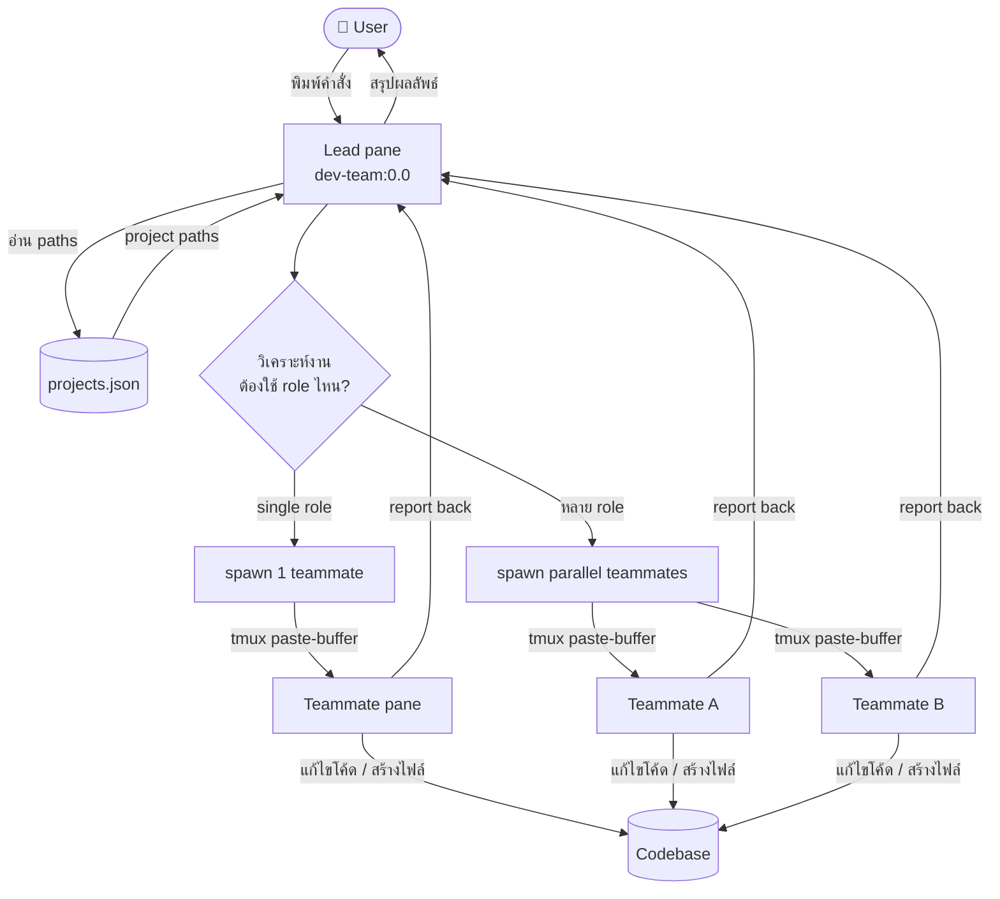
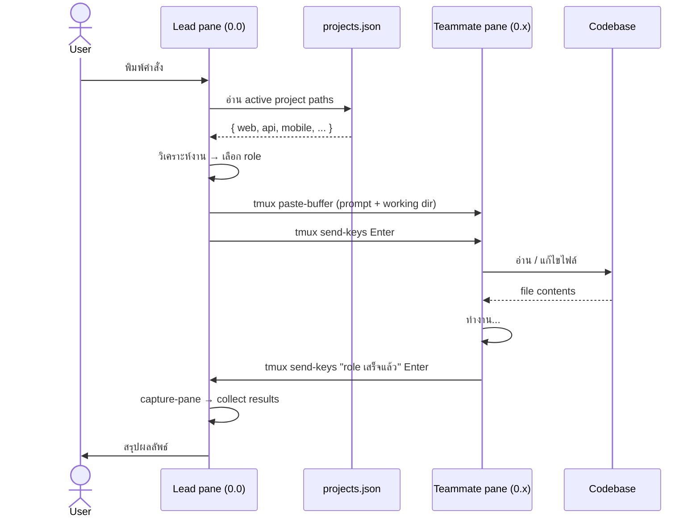
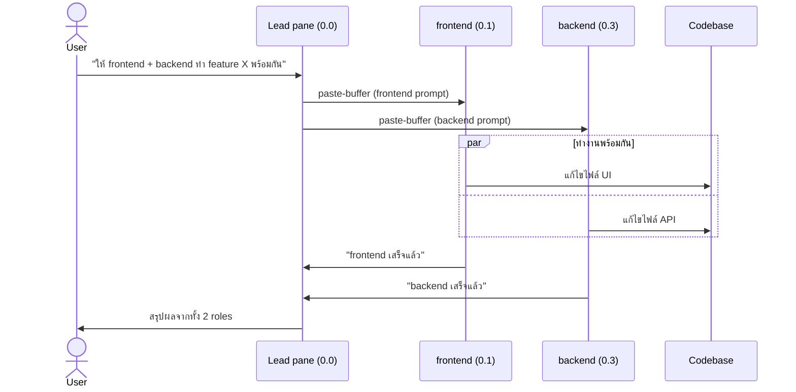

# Dev Team Orchestrator

Multi-agent dev team ที่ใช้ Claude Code + tmux — **Lead** หนึ่งตัวคุม **specialist teammates 7 ตัว** ทำงานข้ามโปรเจ็คได้

แทนที่จะสั่งงาน AI ทีละขั้นตอนด้วยตัวเอง คุณแค่บอก Lead ว่าต้องการอะไร — Lead จะวิเคราะห์งาน เลือก role ที่เหมาะสม spawn agent ไปทำงานพร้อมกันหลายตัว แล้วสรุปผลลัพธ์กลับมาให้ เหมือนมีทีม dev คอยรับงานตลอดเวลา

แต่ละ role เป็น Claude Code agent ที่รันใน tmux pane ของตัวเอง มี working directory และ scope ชัดเจน — frontend แก้ UI, backend แก้ API, qa เขียน test, reviewer ตรวจ code ฯลฯ ทำงานแบบ parallel ได้โดยไม่ต้องรอกัน

รองรับหลาย project ในเครื่องเดียวกัน — สลับ context ได้ทันทีโดยระบุชื่อ project ตอน start

## Architecture

```
┌────────┬─────────┬──────────┐
│        │frontend │ designer │
│        ├─────────┼──────────┤
│        │ backend │          │
│        ├─────────┤    qa    │
│  Lead  │ mobile  │          │
│        ├─────────┼──────────┤
│        │         │ reviewer │
│        │ devops  │          │
│        │         │          │
└────────┴─────────┴──────────┘
```

- User สั่งงานผ่าน **Lead** (pane ซ้าย)
- Lead วิเคราะห์งาน → ส่งต่อให้ specialist ผ่าน `tmux paste-buffer`
- Specialist ทำงานได้เลยทันที — รู้ role ของตัวเองก่อน session เริ่ม
- Specialist คุยกันตรงได้ผ่าน tmux โดย CC Lead ทุกครั้ง
- Specialist ทำเสร็จ → รายงานกลับ Lead → Lead สรุปให้ user

## How it works

### Orchestration Flow



---

### Sequence Diagram — Single Agent



---

### Sequence Diagram — Parallel Agents



## Team roster

| Role | Scope |
|---|---|
| **Frontend** | React, Next.js, TypeScript, browser extension + unit tests |
| **Backend** | REST/GraphQL, database, business logic + unit tests |
| **Mobile** | React Native, Capacitor.js, iOS/Android native modules + unit tests |
| **DevOps** | CI/CD, Docker, deployment, env config |
| **Designer** | Design spec, design tokens, UX review, a11y (ไม่เขียน feature code) |
| **QA** | Integration tests, e2e tests, edge cases, regression |
| **Reviewer** | Code quality, security (OWASP + Snyk), code-level performance |

Agent definitions อยู่ใน [.claude/agents/](.claude/agents/)

## Prerequisites

**macOS / Linux (native)**

| Requirement | Install |
|---|---|
| [tmux](https://github.com/tmux/tmux) 3.1+ | `brew install tmux` |
| [jq](https://jqlang.github.io/jq/) | `brew install jq` |
| [Claude Code CLI](https://docs.claude.com/en/docs/claude-code) | `npm install -g @anthropic-ai/claude-code` แล้ว `claude login` |

**Windows — ต้องใช้ WSL2**

agent-teams ต้องการ tmux ซึ่งไม่มีใน Windows native — รัน `setup-windows.ps1` เพื่อติดตั้ง WSL2 + Ubuntu แล้วทำงานต่อใน Ubuntu terminal

หรือรัน `./install.sh` เพื่อตรวจและติดตั้ง dependencies อัตโนมัติ

## Quick start

**macOS / Linux**

```bash
git clone https://github.com/itseed/agent-teams.git
cd agent-teams
./install.sh
```

**Windows**

```powershell
# เปิด PowerShell as Administrator
Set-ExecutionPolicy -Scope Process -ExecutionPolicy Bypass
.\setup-windows.ps1
```

`setup-windows.ps1` จะ:
- Enable WSL2 + Virtual Machine Platform
- ติดตั้ง Ubuntu (ถ้ายังไม่มี)
- Clone repo เข้า `~/agent-teams` ใน Ubuntu
- รัน `install.sh` ให้อัตโนมัติ

หลังจากนั้นเปิด Ubuntu terminal แล้วใช้งานได้เลย:
```bash
cd ~/agent-teams
./start-team.sh
```

`install.sh` จะ:
- ตรวจและติดตั้ง dependencies (tmux, jq, Claude CLI)
- สร้าง projects.json จาก example
- ตั้งค่า Snyk (optional)

### หลัง install.sh รัน — แก้ paths ใน projects.json ให้ตรงกับเครื่องของคุณ

`projects.json` ไม่ได้อยู่ใน repo เพราะมี absolute paths ของแต่ละเครื่อง — `install.sh` สร้างไฟล์นี้ให้แล้ว แต่ต้องแก้ paths ให้ตรงกับเครื่องของคุณ:

แก้ `projects.json`:

```json
{
  "active": "myproject",
  "projects": {
    "myproject": {
      "description": "My awesome project",
      "paths": {
        "web": "/absolute/path/to/web",
        "api": "/absolute/path/to/api",
        "mobile": "/absolute/path/to/mobile"
      }
    }
  }
}
```

- `active` = project ที่ใช้เมื่อเรียก `./start-team.sh` โดยไม่ระบุชื่อ
- `paths` = working directory ของ role ที่เกี่ยวข้อง (key ไม่จำเป็นต้องครบ — script มี fallback)

### เริ่ม session

```bash
# เริ่ม session (ใช้ active project จาก projects.json)
./start-team.sh

# เริ่ม session สำหรับ project ที่ระบุ
./start-team.sh pms

# จบ session (ถาม confirm)
./stop-team.sh

# จบทันทีไม่ถาม
./stop-team.sh -f
```

หลัง `start-team.sh` รัน Lead pane จะได้รับ context อัตโนมัติว่า agents พร้อมแล้ว pane ไหน project อะไร — สั่งงานได้เลยโดยไม่ต้องอธิบาย session state ทุกครั้ง

> **ปิด terminal ไปโดยไม่ได้ตั้งใจ?** รัน `./start-team.sh` อีกครั้ง — script จะถามให้ resume session เดิม agent ที่ทำงานค้างอยู่จะยังอยู่ครบ

## วิธีใช้งาน

### สั่งงานผ่าน Lead

พิมพ์คำสั่งเป็นภาษาธรรมชาติใน Lead pane (ซ้าย):

```
เพิ่ม feature login พร้อม API
```

```
ให้ frontend และ backend ทำ feature X พร้อมกัน
```

```
รีวิว code ใน auth module ให้หน่อย
```

Lead จะวิเคราะห์งาน → เลือก role ที่เหมาะสม → spawn teammate → collect results → สรุปกลับ

### รูปแบบคำสั่ง

| แบบ | ตัวอย่าง | พฤติกรรม |
|---|---|---|
| **Natural language** | "เพิ่ม feature login" | Lead ตัดสินใจเองว่าต้องใช้ role ไหน |
| **ระบุ role ตรงๆ** | "ให้ frontend ทำ X" | Lead spawn ตาม role ที่ระบุเลย |
| **หลาย role พร้อมกัน** | "ให้ frontend + backend ทำ X พร้อมกัน" | Lead spawn parallel |

### ติดตามผล

Teammate รายงานกลับผ่าน Lead pane อัตโนมัติ Lead จะสรุปผลลัพธ์ให้หลังทุก role เสร็จ

ดูสถานะ pane ใด ๆ ได้ตรงๆ:

```bash
tmux capture-pane -t dev-team:0.1 -p | tail -20
```

### Agent-to-agent communication

Agent สามารถส่งข้อความหากันโดยตรงได้โดยไม่ต้องผ่าน Lead — แต่จะ CC Lead ทุกครั้งเพื่อให้ Lead รับรู้สถานะ:

```
[frontend → backend] ต้องการ response format ของ /auth/login ก่อนทำ form
[backend → frontend] /auth/login พร้อมแล้ว — POST {email, password}, response {token, user}
```

Lead เห็นทุก message และไม่ต้อง relay ด้วยตัวเอง

## File structure

```
agent-teams/
├── CLAUDE.md                  # คู่มือการทำงานของ Lead (โหลดอัตโนมัติทุก session)
├── README.md                  # ไฟล์นี้
├── projects.json.example      # template — copy เป็น projects.json แล้วแก้ paths
├── projects.json              # (gitignored) paths เฉพาะเครื่องของคุณ
├── install.sh                 # one-command setup (ตรวจ deps, สร้าง projects.json, ตั้งค่า Snyk)
├── start-team.sh              # spawn tmux session + 8 panes
├── stop-team.sh               # kill session
└── .claude/
    ├── agents/                # agent definitions (7 roles)
    │   ├── frontend.md
    │   ├── backend.md
    │   ├── mobile.md
    │   ├── devops.md
    │   ├── designer.md
    │   ├── qa.md
    │   └── reviewer.md
    └── settings.json          # permissions + hooks
```

## Pane index mapping

tmux assign pane index ตาม order ของ split — **ไม่เรียงตามตำแหน่งสายตา**:

| Role | Pane |
|---|---|
| Lead | `dev-team:0.0` |
| frontend | `dev-team:0.1` |
| designer | `dev-team:0.2` |
| backend | `dev-team:0.3` |
| mobile | `dev-team:0.4` |
| devops | `dev-team:0.5` |
| qa | `dev-team:0.6` |
| reviewer | `dev-team:0.7` |

Pane title ใช้ tmux user option `@role` (ไม่โดน claude เขียนทับ)

## Customizing agents

แต่ละ role มี agent definition อยู่ใน `.claude/agents/<role>.md` — แก้ได้โดยตรงเพื่อปรับ scope, เพิ่ม constraints, หรือ inject context เฉพาะ project:

```
.claude/agents/
├── frontend.md   # แก้เพื่อเพิ่ม design system, component library ที่ใช้
├── backend.md    # แก้เพื่อระบุ ORM, auth pattern, API convention
├── mobile.md     # แก้เพื่อระบุ RN version, navigation library
├── devops.md     # แก้เพื่อระบุ cloud provider, CI/CD platform
├── designer.md   # แก้เพื่อเพิ่ม Figma link, design token system
├── qa.md         # แก้เพื่อระบุ test framework, coverage target
└── reviewer.md   # แก้เพื่อเพิ่ม coding standards, security checklist
```

การเปลี่ยนแปลงมีผลทันทีในครั้งถัดไปที่ Lead spawn role นั้น ไม่ต้อง restart session

---

## Troubleshooting

### Prompt ค้างใน pane ไม่ submit

ปัญหานี้ลดลงมากแล้วเพราะทุก paste-buffer มี `sleep 0.5` คั่นก่อน Enter

ถ้ายังเกิดขึ้น:

```bash
# ตรวจสอบว่า prompt ค้างอยู่ไหม
tmux capture-pane -t dev-team:0.1 -p | tail -5

# ส่ง Enter เพิ่ม
tmux send-keys -t dev-team:0.1 Enter

# ถ้ายังไม่ผ่าน ส่ง Escape ก่อนแล้วค่อย Enter
tmux send-keys -t dev-team:0.1 Escape
tmux send-keys -t dev-team:0.1 Enter
```

### Agent ทำงานเสร็จแต่ไม่ report back

```bash
# ดู output ล่าสุดของ pane ที่ต้องการ
tmux capture-pane -t dev-team:0.1 -p | tail -20
```

ถ้าเห็นว่า agent เสร็จแล้ว สามารถ collect results เองได้เลยโดยไม่ต้องรอ

### Session หาย / pane ไม่ตรงกับที่คาด

```bash
# ดู pane ทั้งหมดใน session
tmux list-panes -t dev-team -F "#{pane_index} #{@role}"

# kill แล้ว start ใหม่
./stop-team.sh -f && ./start-team.sh
```

---

## Changelog

### 2026-05-09

**Role isolation** — agents แต่ละตัวเริ่มใน `/tmp/agent-<role>/` ที่มี CLAUDE.md ระบุ specialist role ไว้ตั้งแต่ต้น ป้องกันปัญหา agent คิดว่าตัวเองเป็น Lead เมื่อเริ่มบน project ใหม่

**Startup context injection** — Lead ได้รับ context อัตโนมัติเมื่อ session เริ่ม (project name, paths, pane mapping) ไม่ต้องบอก Lead ซ้ำทุกครั้ง

**Peer-to-peer communication** — agent คุยกันตรงได้ผ่าน tmux โดย CC Lead ทุกครั้ง ลดการ bottleneck ที่ Lead

**Clarified responsibilities** — ขีดเส้นแบ่งชัดขึ้นเพื่อลด overlap:
- Designer: output spec/tokens เท่านั้น (ไม่เขียน feature code)
- QA: integration/e2e เท่านั้น (unit test = หน้าที่ dev agent)
- Reviewer: performance จาก code เท่านั้น (ไม่ใช่ regression testing)

**Submit reliability** — รวม `paste-buffer` + `sleep 0.5` + `send-keys Enter` ไว้ในคำสั่งเดียว ป้องกัน submit ไม่สมบูรณ์

**Auto trust prompt** — `start-team.sh` ตอบ Claude Code folder trust prompt อัตโนมัติสำหรับทุก agent pane

**Mobile: Capacitor.js** — เพิ่ม Capacitor.js เข้า mobile agent skill set

---

## อ่านต่อ

- [CLAUDE.md](CLAUDE.md) — คู่มือการวางแผน, spawn, collect results ของ Lead
- [.claude/agents/](.claude/agents/) — scope + rules ของแต่ละ role
